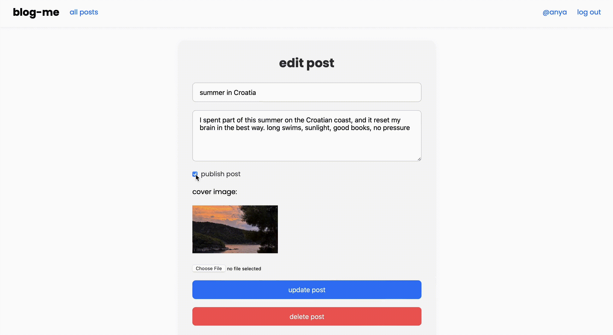

# blog-me

**blog-me** is a blogging platform with two unique experiences: a clean public blog for readers, and a powerful author dashboard for writers. I built **two separate frontends** to ensure better UX for both roles withoun unneccessary functionality.

## preview

a video preview is available in the frontend-public/public/blogme-preview directory

  
  
  
  

---

## features

- **authentication** with JWT + bcrypt
- **separate author interface** (React 19 + Vite) to manage posts
- **image upload** with `multer` + `Cloudinary`
- **comment system** under each post
- **post visibility** toggle (published/draft)
- **Prisma ORM + PostgreSQL** for oersistent backend

---

## tech stack

### backend

- Node.js + Express
- PostgreSQL + Prisma ORM
- JWT + bcrypt for auth
- Multer + Cloudinary for image uploads
- dotenv for secure config

### frontend

- React 19 + Vite
- React Router
- Tailwind CSS
- LocalStorage for token/session
- Custom components: `PostCard`, `CreatePostForm`, `EditPost`, `CommentList`

---

## next steps

- add markdown support for post formatting
- add search bar and filtering by tag/category
- like system or emoji-based reactions
- archive view with calendar-based navigation
- UI polish — animations, transitions, better empty states

---

## what i learned

- structuring fullstack apps with clean separation between frontend/backend
- thinking about UX for different roles (writer vs reader)

---

i am currently building out my portfolio — learning fast, building fast, and refining my craft every day. if this project speaks to you, feel free to [connect with me](https://github.com/ssendns). i am always open to collaborating on cool, meaningful projects.
